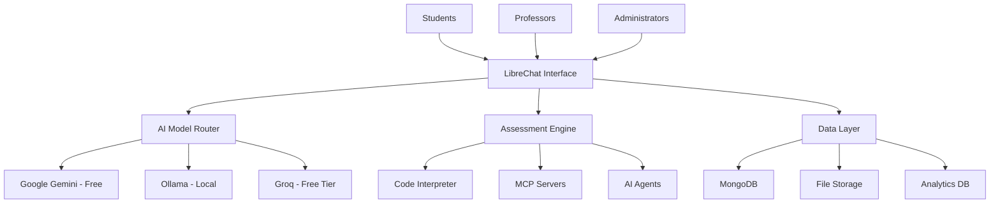

# LibreChat Educational Assessment Platform Demo

A comprehensive demonstration of LibreChat's capabilities for educational institutions, featuring live AI assessments, automated grading, and intelligent tutoring - all using completely free AI models.

## Cost-Effective AI Strategy

- $0/month for unlimited local model usage (Ollama)
- $0/month for generous Gemini free tier (1M tokens/day)
- Saves thousands annually vs paid API solutions
- No vendor lock-in - switch between models freely

## Quick Start (15 Minutes)

```bash
# Clone and run prelab setup
git clone [your-repo-url]
cd librechat-demos
chmod +x setup-prelab.sh
./setup-prelab.sh
```

Then visit: http://localhost:3080

## What You'll Discover

### Core LibreChat Features
- Multi-Model Support - Gemini, Ollama, Groq (all free!)
- MCP Integration - Extend with custom tools
- Code Artifacts - Generate React/HTML in real-time
- Code Interpreter - Execute code securely
- AI Agents - Specialized assessment assistants
- Multimodal - Text, images, documents

### Educational Assessment Capabilities  
- Math Assessments - Step-by-step solution analysis
- Programming Evaluation - Automated code review and testing
- Essay Grading - AI-powered rubric-based feedback
- Research Validation - Source verification and fact-checking
- Creative Projects - Art, design, and multimedia assessment
- Real-time Analytics - Student progress tracking

## Documentation

- [15-Minute Prelab Guide](docs/prelab-guide.md) - Get started quickly
- [Complete Setup Guide](docs/setup-guide.md) - Detailed installation
- [Feature Demonstrations](docs/feature-demos.md) - Showcase examples
- [Assessment Platform Guide](docs/assessment-platform-guide.md) - Educational implementation
- [Free Models Guide](docs/free-models-guide.md) - AI model comparison
- [Troubleshooting](docs/troubleshooting.md) - Common issues

## Demo Scenarios

### [01 - Basic Setup](demos/01-basic-setup/)
Get LibreChat running with free AI models in minutes.

### [02 - MCP Integration](demos/02-mcp-integration/)  
Extend capabilities with Model Context Protocol servers.

### [03 - Artifacts Showcase](demos/03-artifacts-showcase/)
Generate interactive React components and HTML content.

### [04 - Code Interpreter](demos/04-code-interpreter/)
Execute and analyze code across multiple programming languages.

### [05 - AI Agents Demo](demos/05-agents-demo/)
Specialized agents for math, coding, essays, and research.

### [06 - Web Search](demos/06-web-search/)
Real-time information retrieval and fact-checking.

### [07 - Assessment Platform](demos/07-assessment-platform/)
Complete educational assessment and grading system.

### [08 - Multi-Modal](demos/08-multi-modal/)
Process images, documents, and mixed media content.

## Educational Use Cases

### For Professors
- **Live Coding Assessments** - Real-time code review and feedback
- **Essay Evaluation** - Consistent, detailed grading with rubrics
- **Research Projects** - Source validation and citation checking
- **Math Problem Solving** - Step-by-step solution analysis
- **Creative Assignments** - Multimedia project evaluation

### For Students  
- **Instant Feedback** - Get help 24/7 with AI tutors
- **Code Debugging** - Real-time programming assistance
- **Research Help** - Source verification and fact-checking
- **Writing Support** - Grammar, style, and structure feedback
- **Study Assistance** - Personalized learning paths

### For Administrators
- **Cost Savings** - Eliminate expensive AI API subscriptions
- **Scalability** - Support unlimited students and faculty
- **Privacy** - Keep sensitive data on institutional servers
- **Compliance** - FERPA-compliant student data handling
- **Analytics** - Comprehensive learning and teaching insights

## Technical Architecture



## System Requirements

**Minimum**:
- 8GB RAM
- 4 CPU cores  
- 50GB disk space
- Docker & Docker Compose

**Recommended**:
- 16GB RAM
- 8 CPU cores
- 100GB disk space
- GPU (for faster local models)

## Success Metrics

After completing this demo, you'll have:
- Functional AI assessment platform
- Multiple working demo scenarios
- Cost-effective AI model integration
- Educational workflow examples
- Scalable architecture foundation

## Contributing

This project showcases educational applications of AI. Contributions welcome for:
- Additional assessment scenarios
- New educational workflows  
- Integration with LMS platforms
- Accessibility improvements
- Multilingual support

## License

Open source under MIT License. Free for educational and commercial use.

## Support

- [Documentation](docs/)
- [GitHub Issues](issues/)
- [Discussion Forum](discussions/)
- [Educational Resources](docs/educational-resources.md)

---

Built for Education, Powered by Free AI
