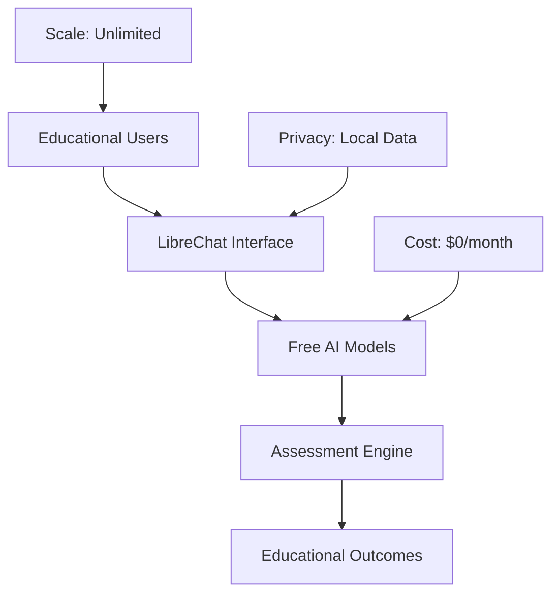

# LibreChat Educational Assessment Platform - Documentation

Welcome to the comprehensive documentation for the LibreChat Educational Assessment Platform demo repository.

## 📚 Documentation Overview

This documentation provides everything you need to understand, deploy, and use LibreChat for educational assessment purposes using **100% FREE AI models**.

## 🚀 Quick Navigation

### Getting Started
- **[15-Minute Prelab Guide](prelab-guide.md)** - Fast track to testing LibreChat
- **[Complete Setup Guide](setup-guide.md)** - Detailed installation and configuration
- **[Troubleshooting](troubleshooting.md)** - Common issues and solutions

### Features & Capabilities
- **[Feature Demonstrations](feature-demos.md)** - Showcase of all capabilities
- **[Free Models Guide](free-models-guide.md)** - AI model comparison and setup
- **[Assessment Platform Guide](assessment-platform-guide.md)** - Educational implementation

### Reference
- **[Quick Reference](quick-reference.md)** - Commands, prompts, and shortcuts
- **[Educational Resources](educational-resources.md)** - Additional learning materials

## 🎯 Documentation Goals

### For Educators
- **Understand** how AI can transform educational assessment
- **Implement** cost-effective AI solutions in your institution
- **Scale** assessment capabilities without budget constraints
- **Maintain** student privacy and data compliance

### For Administrators
- **Evaluate** cost savings vs. commercial AI platforms
- **Plan** institutional deployment strategies
- **Ensure** FERPA compliance and data security
- **Measure** educational impact and ROI

### For Technical Teams
- **Deploy** LibreChat in educational environments
- **Configure** free AI models and integrations
- **Customize** assessment workflows and agents
- **Integrate** with existing LMS platforms

## 💰 Cost Savings Focus

Every guide emphasizes the **$1,000-$10,000 annual savings** possible by using free AI models instead of commercial APIs:

- **Google Gemini**: 1M tokens/day free vs. $7/1M tokens paid
- **Ollama Models**: Unlimited local usage vs. $15-30/1M tokens
- **Groq**: Fast inference free tier vs. premium pricing
- **No vendor lock-in**: Switch between models freely

## 🏗️ Architecture Understanding

The documentation helps you understand:

## 📋 Documentation Structure

### Level 1: Quick Start (15 minutes)
Perfect for initial evaluation and testing.

### Level 2: Full Implementation (1-2 hours)
Complete setup with all features enabled.

### Level 3: Production Deployment (1-2 days)
Enterprise-ready configuration with security and compliance.

## 🎓 Educational Use Cases Covered

### Assessment Types
- **Programming**: Code review, debugging, testing
- **Mathematics**: Step-by-step problem solving
- **Writing**: Essay grading, feedback, plagiarism detection
- **Research**: Source verification, fact-checking
- **Creative**: Art, design, multimedia evaluation

### User Roles
- **Students**: 24/7 AI tutoring and assistance
- **Professors**: Automated grading and feedback
- **Administrators**: Analytics and cost management

## 🔧 Technical Requirements

### Minimum System
- 8GB RAM, 4 CPU cores, 50GB disk
- Docker & Docker Compose
- Internet connection for model downloads

### Recommended System
- 16GB RAM, 8 CPU cores, 100GB disk
- GPU for faster local model inference
- Dedicated server for production use

## 📈 Success Metrics

After following this documentation:

- ✅ **Functional AI assessment platform** running locally
- ✅ **Multiple AI models** configured and tested
- ✅ **Educational workflows** demonstrated
- ✅ **Cost savings** quantified and verified
- ✅ **Scalability path** planned for your institution

## 🤝 Community & Support

### Getting Help
- **GitHub Issues**: Technical problems and bugs
- **Discussions**: Educational use cases and best practices
- **Documentation**: Comprehensive guides and tutorials

### Contributing
- **Assessment Scenarios**: Share your educational workflows
- **Model Configurations**: Optimize for specific subjects
- **Integration Guides**: Connect with LMS platforms
- **Accessibility**: Improve inclusive design

## 🎯 Next Steps

1. **Start with [Prelab Guide](prelab-guide.md)** for quick testing
2. **Review [Feature Demos](feature-demos.md)** for capabilities overview
3. **Follow [Setup Guide](setup-guide.md)** for full implementation
4. **Explore [Assessment Platform](assessment-platform-guide.md)** for educational workflows

---

**Ready to transform education with free AI?** Start with the [15-Minute Prelab Guide](prelab-guide.md)! 🚀

---

*Built for Education, Powered by Free AI* 🎓✨
